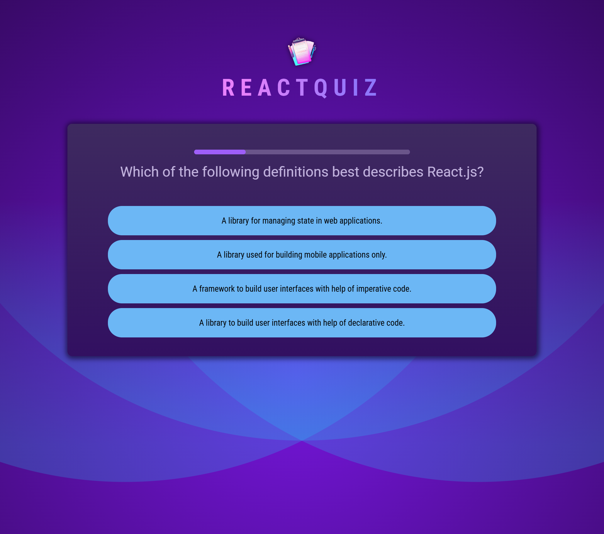
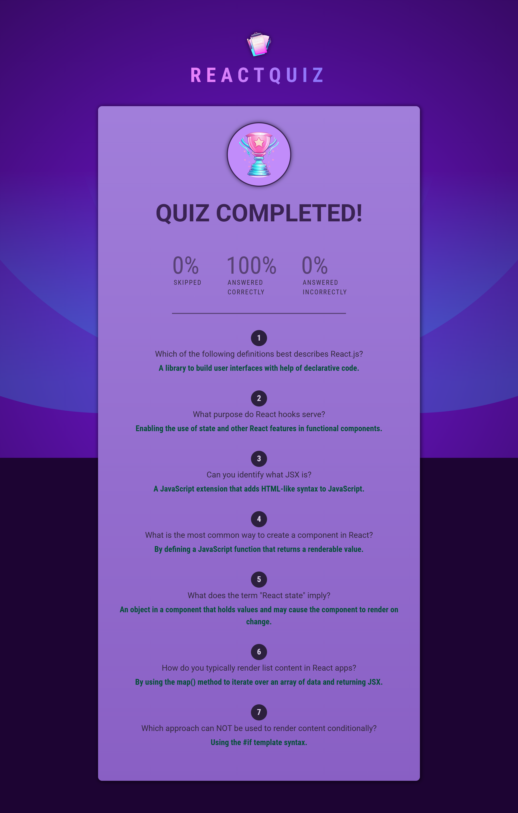

# 🏆 React Quiz App

A modern and interactive quiz application built with **React.js**, designed to test and improve your React knowledge.

---

## 🚀 Features

✔️ Multiple-choice questions  
✔️ Real-time progress tracking  
✔️ Score calculation at the end  
✔️ Responsive and visually appealing UI

---

## 📸 Screenshots

### Quiz in Progress



### Quiz Completed



---

## 🔧 Installation

Follow these steps to set up the project locally:

```sh
# Clone the repository
git clone https://github.com/yourusername/react-quiz-app.git

# Navigate to the project directory
cd react-quiz-app

# Install dependencies
npm install

# Start the development server
npm start
```

---

## 🛠️ Technologies Used

- **React.js** – Component-based UI development
- **JavaScript (ES6+)** – Modern JS features
- **CSS3** – Custom styling
- **Vite** – Fast development build tool

---

## 🎯 Usage

1. Start the quiz and answer multiple-choice questions.
2. View your final score at the end.

---

## 📜 License

This project is licensed under the **MIT License**. Feel free to use and modify it as needed.
